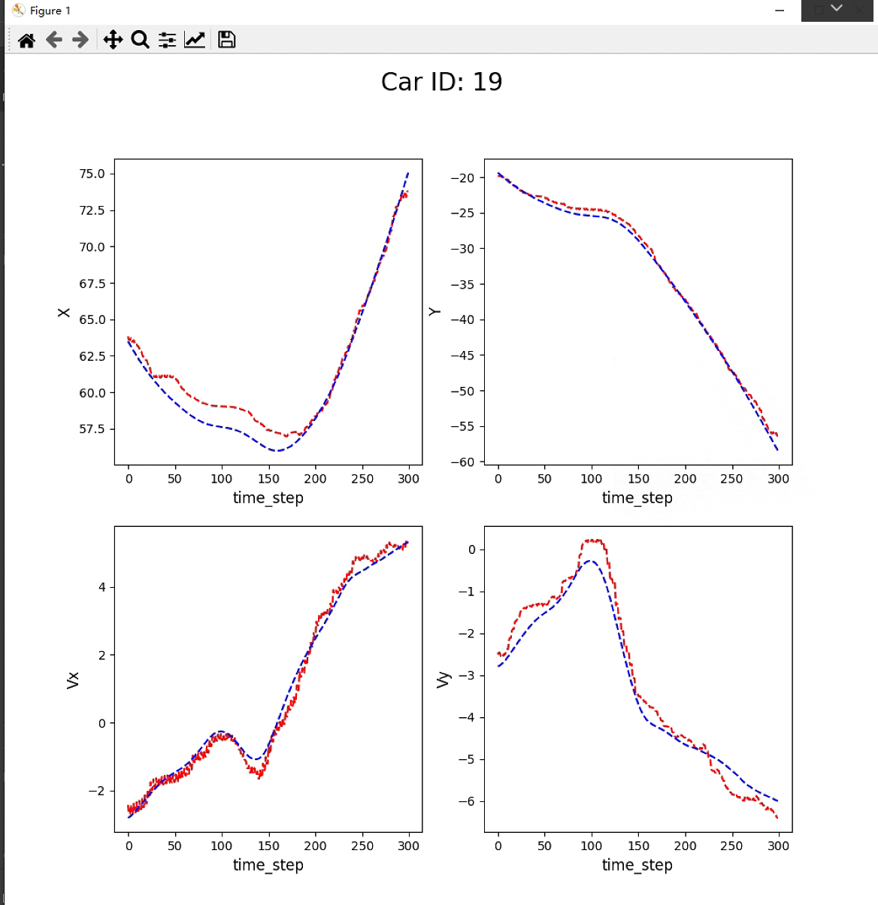

# VehicleTrajectoryPrediction
Vehicle Trajectory Prediction 自用，记录课题进展

# 0303

只有LSTM进行预测的程序，9个点预测一个点

主程序my0224

读取模型进行测试的程序Modeltest

# 0322

attention-based seq2seq模型，自己随便写的，没有进行参数优化

使用了inD数据集，数据处理位于data_process文件夹

**由于某些原因，不提供任何与数据集相关的文件，需要数据集请去[inD官网申请](https://www.ind-dataset.com/)**

使用attention-based-seq2seq0308.py进行训练，Test.py进行测试

使用前需要修改attention-based-seq2seq0308.py中导入dataprocess方法的路径

